GitHub is **not reading/rendering the `mindmap` Mermaid syntax**. Use this GitHub-compatible `flowchart` instead:

```mermaid
flowchart TD
    A["Building Large Language Models"]

    A --> B["Language Modelling"]
    A --> C["Training Data"]
    A --> D["Scaling Laws"]
    A --> E["Evaluation"]
    A --> F["Post-training"]
    A --> G["Systems Engineering"]

    B --> B1["Tokenization and BPE"]
    B --> B2["Transformer Architecture"]
    B --> B3["Next-token Prediction"]
    B --> B4["Cross-entropy Loss"]

    C --> C1["Data Collection"]
    C --> C2["Cleaning and PII Filtering"]
    C --> C3["Deduplication"]
    C --> C4["Quality and Domain Weighting"]

    D --> D1["Model Parameters"]
    D --> D2["Training Tokens"]
    D --> D3["Compute Budget"]
    D --> D4["Chinchilla Scaling"]

    E --> E1["Perplexity"]
    E --> E2["MMLU and Benchmarks"]
    E --> E3["Human Evaluation"]
    E --> E4["Chatbot Arena"]

    F --> F1["Supervised Fine-tuning"]
    F --> F2["RLHF"]
    F --> F3["Reward Modelling"]
    F --> F4["PPO"]
    F --> F5["DPO"]

    G --> G1["GPUs"]
    G --> G2["Mixed Precision"]
    G --> G3["Distributed Training"]
    G --> G4["Operator Fusion"]
    G --> G5["Efficient Inference"]
```



Make sure the opening line is exactly ` ```mermaid ` and there are no spaces before the three backticks.
