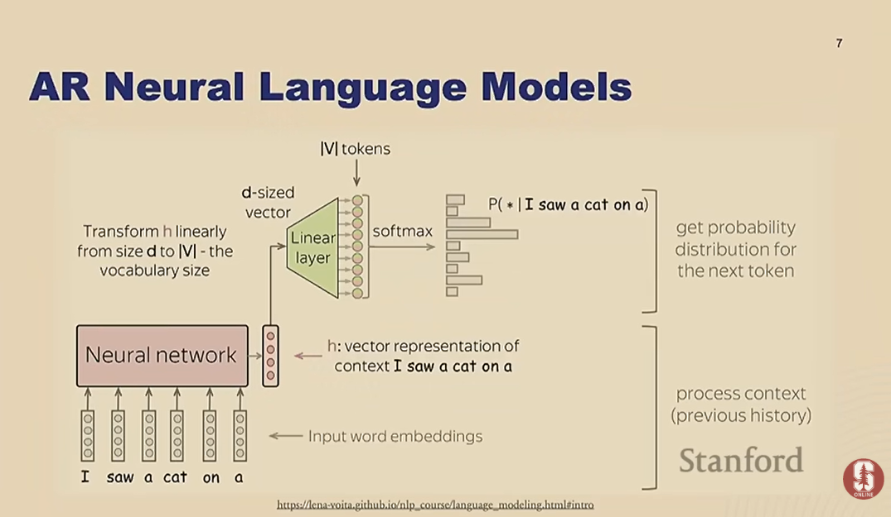

# Machine-Learning-Building-LLMs
Detailed notes and key insights on Large Language Models, covering tokenization, pre training, scaling laws, evaluation, fine0tuning, RLHF, DPO and hardware optimization. 

# Stanford CS229: Building Large Language Models (LLMs)

> Detailed outlined notes from Yann Dubois's Stanford CS229 guest lecture, **Building Large Language Models (LLMs)**.

## Lecture information

- **Course:** Stanford CS229 — Machine Learning
- **Lecturer:** Yann Dubois
- **Topic:** Building a ChatGPT-like large language model from pre-training through post-training
- **Video:** [Stanford CS229 — Building Large Language Models](https://www.youtube.com/watch?v=9vM4p9NN0Ts)
- **Scope:** Language modelling, tokenization, evaluation, data engineering, scaling laws, compute, supervised fine-tuning, preference optimization and systems efficiency

## 1. The complete LLM development pipeline

Building an effective LLM involves much more than selecting a neural-network architecture. The complete pipeline has five interacting components:

1. **Architecture** — commonly a decoder-only Transformer.
2. **Objective/loss** — initially next-token prediction using cross-entropy.
3. **Data** — collection, filtering, deduplication, quality classification and domain mixing.
4. **Evaluation** — language-modelling metrics, downstream benchmarks and human preferences.
5. **Systems** — accelerators, numerical precision, distributed training and optimized kernels.

In this article last 3 topics are discussed as it is tried to be more focused on businesses and market needs and not to have academic approach. 

The overall process has two major phases:

- **Pre-training:** learn a broad statistical model of language from a massive corpus. For example: GPT2 or GPT3
- **Post-training:** adapt the base model to follow instructions and human preferences. Foe example: ChatGPT

### Language Modelling (LM)

A **Language Model (LM)** represents a probability distribution over sequences of tokens or words P(x1, x2, ..., xL).
Here:

- `x1, x2, ..., xL` represent the tokens or words in the sequence.
- `L` represents the total length of the sequence.
- `P(x1, x2, ..., xL)` represents the probability assigned to the complete sequence.

Language models know the structure of sentence and have syntactic knowledge of the sentence as well. 
LMs are generative models.
---

## 2. Autoregressive language modelling *(approximately 00:05)*

### 2.1 A Language Model as a Probability Distribution :  

An LLM is a generative model that assigns probabilities to sequences of tokens. A token sequence can be represented as:

```text
x1, x2, ..., xT
```

Using the probability chain rule, the joint probability of the complete sequence can be represented as:

```text
P(x1, x2, ..., xT) =
P(x1) × P(x2 | x1) × P(x3 | x1, x2) × ... × P(xT | x1, x2, ..., xT-1)
```

Here:

- `x1, x2, ..., xT` represent the tokens in the sequence.
- `P(xT | x1, x2, ..., xT-1)` represents the probability of the current token based on all preceding tokens.
- The vertical line `|` means **given** or **based on the preceding information**.


The model therefore learns one core task: **predicting the next token from the preceding context**.
This is just one way, there are other methods. The down side of this methos is: in case of long sentence generation it take longer time since in backend s FOR LOOP is created and based on that the generation of process takes place therefore, the longer the sentence the longer the loop and as a result the time. 

Simply its task is: to predict the next word.
Steps: 
1) Tokenize
2) Forward (pass through the architecture)
3) Predict probability of next token
4) Sample from the distribution
5) Detokenize

There is an AR neural Language model explained here: 


### Loss: (a simple ML task)
A tsk of classify next tokens' index: 
 
### 2.2 Generation

At inference time, generation is iterative:

1. Supply an initial prompt.
2. Compute a probability distribution over the vocabulary for the next token.
3. Select or sample a token.
4. Append it to the context.
5. Repeat until a stopping condition is reached.

Different decoding strategies—such as greedy decoding, temperature sampling or top-$k$/top-$p$ sampling—change how the next token is selected, but the underlying model still predicts $p(x_t\mid x_{<t})$.

### 2.3 Forward Pass

The forward pass processes input text and calculates the probability of each possible next token.

The basic computation follows these steps:

1. Raw text is converted into tokens.
2. Each token is assigned a unique token ID.
3. The token IDs are mapped to embedding vectors.
4. The embedding vectors pass through the Transformer layers.
5. A linear output layer produces a score, called a **logit**, for every token in the vocabulary.
6. The softmax function converts these logits into probabilities.

The softmax calculation can be represented as:

```text
Probability of token i =
exponential(logit for token i) ÷
sum of the exponential values of all token logits
```

Alternatively:

```text
P(token i | preceding tokens) =
exp(zi) / [exp(z1) + exp(z2) + ... + exp(zV)]
```

Here:

- `V` represents the complete vocabulary.
- `zi` is the logit assigned to token `i`.
- `exp(zi)` calculates the exponential value of the token's logit.
- The denominator adds the exponential values of all logits.
- The vertical line `|` means **given the preceding tokens**.

The resulting probabilities add up to `1`. The model can then select or sample the next token from this probability distribution.

### 2.4 Pre-training loss

The model minimizes negative log-likelihood, implemented as token-level cross-entropy:

$$\mathcal{L}_{\text{LM}}=-\sum_{t=1}^{T}\log p_\theta(x_t\mid x_{<t}).$$

Teacher forcing supplies the real preceding tokens during training. Backpropagation then updates the parameters so the observed next tokens receive higher probability.

---

## 3. Tokenization *(approximately 00:11)*

### 3.1 Why tokenization is needed

Neural networks operate on numbers, not raw text. A tokenizer maps text fragments to integer IDs. A token is not necessarily a word; it may represent:

- a complete word;
- part of a word;
- punctuation or whitespace;
- a digit or group of digits;
- a byte or character sequence.

Subword tokenization balances two competing extremes:

- **Word-level vocabulary:** compact sequences, but an enormous vocabulary and poor handling of unseen words.
- **Character/byte-level vocabulary:** nearly universal coverage, but much longer sequences and greater computational cost.

### 3.2 Byte Pair Encoding (BPE)

BPE builds a vocabulary by repeatedly merging frequent adjacent symbols:

1. Begin with a base vocabulary of small units.
2. Count adjacent token pairs across the training corpus.
3. Merge the most frequent pair into a new token.
4. Add that token to the vocabulary while retaining the smaller tokens.
5. Repeat until the desired vocabulary size is reached.

Each resulting token has a unique integer ID. Because smaller units remain available, unusual words, misspellings and new strings can still be represented.

### 3.3 Tokenization affects model behaviour

Tokenization influences:

- sequence length and therefore attention cost;
- efficiency across different languages;
- handling of misspellings and rare terms;
- numerical reasoning;
- source-code modelling;
- comparability of evaluation metrics.

Numbers can be split inconsistently—for example, by individual digits in one context and multi-digit chunks in another. This makes arithmetic patterns harder to learn and generalize. Tokenization is therefore not a neutral preprocessing step; it changes the learning problem itself.

### 3.4 Possible future direction

Tokenizers are currently useful because Transformer computation becomes expensive as sequence length grows. With more efficient architectures, byte- or character-level modelling may become more practical and reduce tokenizer-specific pathologies.

---

## 4. Evaluating base language models *(approximately 00:21)*

### 4.1 Perplexity

Perplexity measures how uncertain or “surprised” a language model is when predicting the next token in a sequence.

It is calculated by taking the exponential value of the model's average negative log-likelihood:

```text
Perplexity =
exp(average negative log probability of the correct tokens)
```

A simplified representation is:

```text
PPL = exp(
    -1 / number of tokens
    ×
    sum of the log probabilities assigned to the correct tokens
)
```

For example, if a model has a perplexity of `10`, it can be interpreted as being uncertain between approximately 10 possible tokens at each prediction step.

Key points:

- A **lower perplexity** generally means the model predicts the observed token sequence more accurately.
- A **higher perplexity** means the model is more uncertain about the correct next tokens.
- Perplexity is useful for monitoring next-token prediction during pre-training.
- It does not directly measure instruction following, factual accuracy, safety or reasoning ability.
- Perplexity scores may be misleading when comparing models that use different tokenizers or evaluation datasets.

### 4.2 Downstream benchmarks

Benchmarks test capabilities through tasks rather than next-token loss. **MMLU (Massive Multitask Language Understanding)** uses multiple-choice questions from many academic and professional domains, including mathematics, medicine, physics and law.

Typical benchmark evaluation is sensitive to:

- prompt wording and answer format;
- zero-shot versus few-shot prompting;
- decoding configuration;
- scoring and answer-extraction rules;
- implementation differences between evaluation harnesses.

### 4.3 Open-ended generation

Open-ended responses are difficult to score because many different answers may be valid. Exact-match metrics cannot adequately capture correctness, relevance, style or usefulness.

### 4.4 Benchmark contamination

If benchmark questions—or close variants—appear in pre-training data, the resulting score may reflect memorization rather than generalization. Web-scale corpora make train/test separation difficult to guarantee.

### 4.5 Main lesson

There is no single sufficient LLM metric. Reliable evaluation requires a portfolio of carefully specified tests and awareness of leakage, prompts, tokenizers and evaluator bias.

---

## 5. Building the pre-training dataset *(approximately 00:29)*

### 5.1 Raw sources

Web crawls such as **Common Crawl** provide enormous quantities of text. Other sources may include:

- Wikipedia;
- books and academic text;
- GitHub and other code repositories;
- news, forums and question-answer sites;
- curated domain-specific datasets.

The lecture uses **The Pile** as an example of an openly documented mixture containing sources such as Wikipedia, books and GitHub.

### 5.2 Cleaning and filtering pipeline

Raw web data cannot simply be fed into training. A typical pipeline includes:

1. **Content filtering** — remove unwanted sexual, harmful or otherwise excluded material.
2. **PII filtering** — detect and remove personally identifiable information.
3. **Language identification** — retain or weight the required languages.
4. **Structural cleanup** — remove boilerplate such as navigation, repeated headers, footers and URLs.
5. **Deduplication** — remove duplicate documents and repeated substrings or paragraphs.
6. **Quality classification** — score documents using a classifier trained from positive and negative examples.
7. **Domain classification** — label data as code, books, entertainment, reference material and other categories.
8. **Mixture weighting** — choose sampling weights for domains and sources.

### 5.3 Quality classifiers

Documents linked from or resembling high-quality sources such as Wikipedia can serve as positive examples for a quality classifier. The classifier is then applied to the wider crawl to retain or prioritize documents that resemble the desired distribution.

This embeds human and design choices into the data pipeline: the definition of “quality” influences the capabilities and biases of the trained model.

### 5.4 Deduplication matters

Deduplication:

- reduces wasted compute;
- prevents repeated sources from dominating the distribution;
- limits memorization and verbatim reproduction;
- reduces benchmark contamination;
- improves the effective diversity of training data.

### 5.5 Data mixture as a design decision

More tokens are not automatically better. Adjusting the proportions of code, mathematics, books, conversation and other domains can significantly alter reasoning, knowledge and downstream performance. Dataset composition is effectively part of the model design.

---

## 6. Scaling laws *(approximately 00:41)*

### 6.1 Predictable improvement with scale

Empirical scaling laws show that language-model loss improves in a relatively predictable power-law relationship as three resources increase:

- **parameter count** $N$;
- **training tokens** $D$;
- **compute budget** $C$.

A simplified expression is:

$$L(N,D)\approx L_\infty + A N^{-\alpha}+B D^{-\beta}.$$

The exact fitted constants vary, but the operational lesson is that measurements from smaller runs can be used to forecast larger runs.

### 6.2 Old versus scaling-law development

An older workflow might tune a large model through expensive, short experiments. A scaling-law workflow instead:

1. trains a family of smaller models;
2. varies model size, token count and other settings;
3. fits relationships between scale and loss;
4. extrapolates the best recipe to the final large run.

This is critical because a frontier-scale training run is too costly to repeat casually.

### 6.3 Compute-optimal allocation and Chinchilla

Given fixed training compute, model size and token count trade off against one another. The Chinchilla result showed that many earlier models were undertrained: they had too many parameters relative to their training data.

The commonly cited compute-optimal rule from that work is roughly:

$$D\approx 20N,$$

or approximately 20 training tokens per parameter.

### 6.4 Training optimum versus deployment optimum

Compute-optimal training is not necessarily economically optimal over the system's lifetime. A smaller model trained on more tokens may cost more to train but be much cheaper to serve repeatedly. When inference costs matter, the lecture discusses using much more data per parameter—on the order of roughly 150 tokens per parameter—as a practical design direction.

The correct allocation therefore depends on total lifecycle cost:

$$\text{Total cost}=\text{training cost}+\text{cumulative inference cost}.$$

---

## 7. Training compute, cost and environmental impact *(approximately 00:55)*

### 7.1 Approximate Transformer training compute

A commonly used estimate for dense Transformer training is:

$$C\approx 6ND,$$

where $N$ is the parameter count and $D$ is the number of training tokens. The factor accounts approximately for forward and backward computations per parameter-token pair.

### 7.2 Frontier-scale resource requirements

The lecture's large-model example illustrates the magnitude of frontier training:

- trillions of training tokens;
- clusters containing thousands of GPUs;
- tens of millions of GPU-hours;
- training over many weeks;
- a total cost potentially in the tens of millions of dollars;
- significant supporting costs for engineering, infrastructure and data.

The lecture gives an illustrative estimate of approximately **26 million GPU-hours**, around **70 days**, and approximately **$75 million** in total cost for a frontier-scale run.

### 7.3 Governance threshold

Training compute is also becoming a governance variable. The lecture refers to a US reporting/scrutiny threshold around $10^{26}$ floating-point operations, showing that scaling decisions can have regulatory as well as engineering consequences.

### 7.4 Carbon impact

The example estimate is on the order of **4,000 tonnes of CO₂ equivalent**. Actual emissions depend on hardware efficiency, utilization, data-centre overhead and the electricity mix. Training impact must also be considered alongside the potentially much larger cumulative cost of serving a widely used model.

---

## 8. Post-training: from base model to assistant *(approximately 01:02)*

A pre-trained model is optimized to continue text, not necessarily to answer questions helpfully or follow instructions. Post-training changes its behaviour using a much smaller but more targeted dataset.

### 8.1 Supervised fine-tuning (SFT)

SFT trains the base model on instruction-response demonstrations:

$$\mathcal{L}_{\text{SFT}}=-\sum_t\log p_\theta(y_t\mid x,y_{<t}),$$

where $x$ is the instruction and $y$ is the desired response.

Although the data format changes, the objective remains language modelling: maximize the likelihood of the demonstrated answer.

### 8.2 Quality can outweigh quantity

The lecture cites **LIMA**, whose “less is more” result suggests that a comparatively small, carefully selected instruction dataset can strongly shape behaviour. Increasing SFT data from roughly 2,000 to 32,000 examples did not necessarily provide a proportionate improvement.

The implication is that pre-training supplies most of the knowledge and broad capabilities, while high-quality SFT teaches the model the desired interaction format and response style.

### 8.3 Limitation of behavioural cloning

SFT imitates human demonstrations. However:

- creating an ideal answer is difficult and expensive;
- people may be better at comparing candidate answers than writing the best answer themselves;
- a demonstration provides only one acceptable response even when many are possible.

These limitations motivate learning from preferences.

---

## 9. Reinforcement Learning from Human Feedback (RLHF) *(approximately 01:12)*

### 9.1 Preference-data collection

For a given prompt:

1. The model generates multiple candidate responses.
2. Human annotators compare or rank them.
3. The comparisons express which behaviours people prefer.

This is often easier than asking annotators to author a perfect response.

### 9.2 Reward modelling

A reward model $r_\phi(x,y)$ learns a scalar score for response $y$ to prompt $x$. For preferred response $y_w$ and rejected response $y_l$, a Bradley–Terry-style objective can be written as:

$$\mathcal{L}_{\text{RM}}=-\log\sigma\left(r_\phi(x,y_w)-r_\phi(x,y_l)\right).$$

The reward model produces a continuous learning signal, conveying more information than a single binary reward applied directly to the policy.

### 9.3 Policy optimization with PPO

The language model is treated as a policy. PPO updates it to maximize the learned reward while a KL-divergence penalty keeps it near a reference model:

$$\max_\theta\;\mathbb{E}_{y\sim\pi_\theta(\cdot\mid x)}
\left[r_\phi(x,y)-\beta D_{\mathrm{KL}}\left(\pi_\theta\|\pi_{\mathrm{ref}}\right)\right].$$

The constraint matters because unconstrained optimization may exploit imperfections in the reward model—reward hacking—and degrade language quality.

### 9.4 Why PPO is difficult in practice

PPO-based RLHF requires a complex training system involving:

- online generation/rollouts;
- a policy model;
- a reference policy;
- a reward model;
- often a value model;
- clipping, KL control and unstable hyperparameters.

It is theoretically attractive but operationally complicated and expensive.

---

## 10. Direct Preference Optimization (DPO) *(approximately 01:20)*

DPO avoids explicit reward-model fitting and online reinforcement learning. It directly trains on preferred and rejected response pairs.

Conceptually, it:

- raises the relative probability of the preferred response;
- lowers the relative probability of the rejected response;
- regularizes the updated model against a reference model.

A standard DPO objective is:

$$\mathcal{L}_{\text{DPO}}=-\log\sigma\left(\beta\left[
\log\frac{\pi_\theta(y_w\mid x)}{\pi_{\mathrm{ref}}(y_w\mid x)}-
\log\frac{\pi_\theta(y_l\mid x)}{\pi_{\mathrm{ref}}(y_l\mid x)}
\right]\right).$$

Compared with PPO-based RLHF, DPO turns preference alignment into a simpler supervised-style optimization problem. It removes the separate learned reward model and the online policy-optimization loop.

---

## 11. Problems with preference data *(approximately 01:24)*

### 11.1 Length bias

Annotators and automated evaluators may prefer longer answers even when a shorter answer is more correct or useful. A model trained on these preferences can learn verbosity as a shortcut for reward.

### 11.2 Annotator inconsistency

Preference labels are noisy. The lecture notes that an individual human may agree with their own earlier binary judgment only around **66%** of the time. Preferences depend on expertise, framing, attention and subjective taste.

### 11.3 LLM-generated feedback

LLMs are increasingly used as annotators or judges because they are cheaper, scalable and may agree more consistently with the modal human label. This changes “RLHF” in practice: some feedback is AI-generated rather than directly human-generated.

Risks include:

- inheriting the judge model's biases;
- preferring stylistic signals over factual quality;
- self-reinforcing errors;
- reduced diversity of judgments.

### 11.4 Data scale across phases

The phases use radically different quantities of data:

- **Pre-training:** up to trillions of tokens.
- **SFT/preference training:** potentially millions of tokens or fewer.

Small post-training datasets can nevertheless cause large behavioural changes because they steer an already capable pre-trained model.

---

## 12. Evaluating aligned assistants *(approximately 01:30)*

### 12.1 Why perplexity is insufficient after post-training

An assistant is optimized for human usefulness and preference, not merely for maximum likelihood on generic text. A model can become more helpful while its perplexity on a text corpus does not improve—and may worsen.

### 12.2 Chatbot Arena

Chatbot Arena performs blind human pairwise comparisons:

1. A user submits a prompt.
2. Two anonymous models generate answers.
3. The user selects the better response or declares a tie.
4. Aggregated pairwise results produce relative rankings, commonly using an Elo-style system.

Strengths include real user prompts and direct comparison of assistant quality. Limitations include user-population bias, preference noise and limited diagnostic detail.

### 12.3 LLM-as-a-judge and AlpacaEval

AlpacaEval uses a capable LLM to compare responses automatically. The lecture reports very high correlation—approximately **98%**—with aggregate Chatbot Arena results in the referenced setting.

Automated judging is fast and inexpensive, but results depend on the judge model, prompt, position/order effects and biases such as preference for longer answers.

---

## 13. Reframing pre-training and post-training *(approximately 01:35)*

One provocative framing from the lecture is:

- pre-training provides a powerful **initialization** of the parameters;
- post-training determines how those capabilities are expressed as an assistant.

This emphasizes that low-volume post-training data is not an insignificant finishing step. It may define the model's visible behaviour, refusal patterns, style and practical usefulness.

---

## 14. Hardware and systems optimization *(approximately 01:38)*

### 14.1 Why GPUs

LLM workloads are dominated by large matrix multiplications. GPUs provide:

- massive parallelism;
- high arithmetic throughput;
- specialized matrix-multiplication units;
- high-bandwidth device memory.

The key goal is not only to reduce arithmetic operations but also to keep expensive hardware busy and minimize data movement.

### 14.2 Reduced precision

Using 16-bit rather than 32-bit values can:

- increase arithmetic throughput;
- reduce memory consumption;
- reduce memory bandwidth requirements;
- permit larger batches or models.

### 14.3 Automatic mixed precision

Mixed precision combines speed with numerical stability. Operations suited to low precision run in FP16 or BF16, while sensitive values or master weights may remain in FP32. Loss scaling may be used with FP16 to reduce underflow.

### 14.4 Operator fusion

Executing many small GPU operations separately causes repeated kernel launches and movement between GPU memory and compute units. Operator fusion combines compatible operations into fewer kernels, reducing overhead and memory traffic.

In PyTorch, tools such as `torch.compile` can capture and optimize computation graphs, including kernel fusion. The systems lesson is that memory movement is often a major bottleneck; mathematically equivalent programs can have very different runtime performance.

---

## 15. End-to-end training recipe

### Phase A — Define the target

1. Set the model's capability, language and deployment requirements.
2. Estimate training and lifetime inference budgets.
3. Choose evaluation suites before the final run.

### Phase B — Construct the data

1. Collect web, code and curated sources.
2. Parse and normalize documents.
3. Remove disallowed material and PII.
4. Deduplicate documents and repeated spans.
5. Score quality and classify domains.
6. Choose source-mixture weights.
7. Train the tokenizer on a representative corpus.

### Phase C — Find the scaling recipe

1. Train smaller models across parameter and token budgets.
2. Fit scaling curves.
3. Select a compute- and deployment-aware parameter/token allocation.
4. Validate optimizer, stability and systems utilization.

### Phase D — Pre-train

1. Train the Transformer using next-token cross-entropy.
2. Monitor loss, perplexity, benchmark performance and instabilities.
3. Save checkpoints and investigate data or evaluation regressions.

### Phase E — Post-train

1. Perform SFT on high-quality demonstrations.
2. Collect preferred/rejected response pairs.
3. Apply PPO-based RLHF or direct preference optimization.
4. Control divergence from the reference model.

### Phase F — Evaluate and deploy

1. Run capability, safety and domain evaluations.
2. Use human pairwise testing and carefully controlled model judges.
3. Optimize precision, kernels and serving configuration.
4. Monitor real-world quality, cost, latency and failure modes.

---

## 16. Central conclusions

1. **An LLM begins as a next-token predictor.** Autoregressive factorization turns sequence modelling into repeated conditional prediction.
2. **The architecture is only one component.** Data, evaluation and systems engineering often determine whether a model succeeds.
3. **Tokenization changes the task.** It influences efficiency, multilingual performance, mathematics, code and metric comparability.
4. **Data engineering is model engineering.** Filtering, deduplication, quality scoring and mixture weights shape capabilities and biases.
5. **Scaling is predictable enough to guide investment.** Smaller experiments help choose recipes before committing to a frontier run.
6. **The training-optimal model may not be deployment-optimal.** Lifetime inference cost can favour smaller, more heavily trained models.
7. **Post-training creates the assistant behaviour users observe.** SFT and preference optimization steer capabilities learned during pre-training.
8. **Preference learning contains human and evaluator biases.** Length bias, inconsistency and judge-model bias must be measured and controlled.
9. **Evaluation is multidimensional.** Perplexity, benchmarks, human comparisons and automated judges each capture different properties.
10. **Systems optimization is essential.** Reduced precision, efficient kernels and less data movement translate directly into feasible training and serving.

> **Source note:** These study notes are based primarily on Yann Dubois's Stanford CS229 guest lecture, *Building Large Language Models (LLMs)*. Additional explanations and standard mathematical concepts have been included for clarity. The notes are independently written and are not an official Stanford transcript.

## References

- [Video: Stanford CS229 — Building Large Language Models (LLMs)](https://www.youtube.com/watch?v=9vM4p9NN0Ts)
- Hoffmann et al., [Training Compute-Optimal Large Language Models](https://arxiv.org/abs/2203.15556) — Chinchilla scaling
- Zhou et al., [LIMA: Less Is More for Alignment](https://arxiv.org/abs/2305.11206)
- Ouyang et al., [Training Language Models to Follow Instructions with Human Feedback](https://arxiv.org/abs/2203.02155)
- Rafailov et al., [Direct Preference Optimization: Your Language Model Is Secretly a Reward Model](https://arxiv.org/abs/2305.18290)

---

> **Note:** The equations and compact technical explanations organize and formalize the concepts presented in the lecture; they are not a verbatim transcript.
